# 🍽️ Yummy — AI Destekli Restoran Yönetim ve Web Uygulaması

> Modern restoranlar için geliştirilmiş, **yapay zeka destekli fullstack web uygulaması.**  
> Hem admin paneli hem de kullanıcı arayüzü ile uçtan uca eksiksiz bir restoran yönetim sistemi sunar.

---

## 📸 Proje Görselleri

### 🌐 Kullanıcı Arayüzü

| Ana Sayfa Hero ||
|:-:|:-:|
| 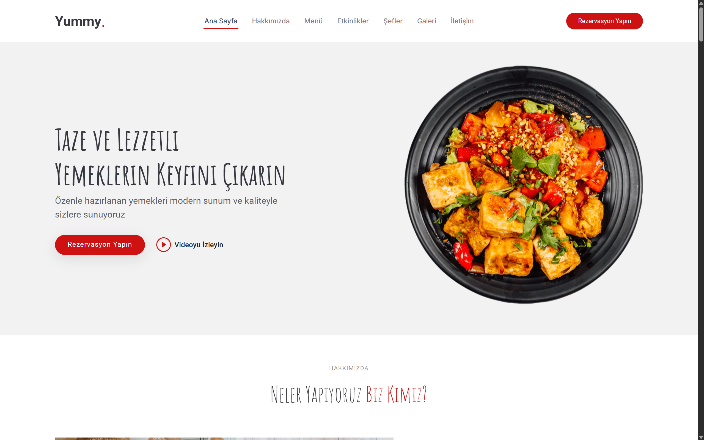 

| Neden Yummy? | Menü |
|:-:|:-:|
| 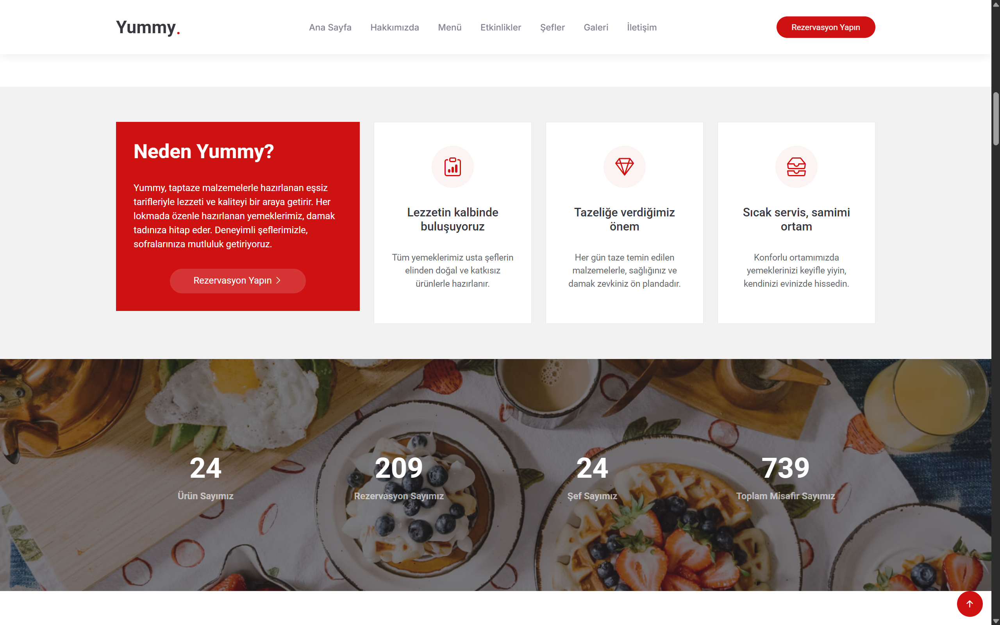 | 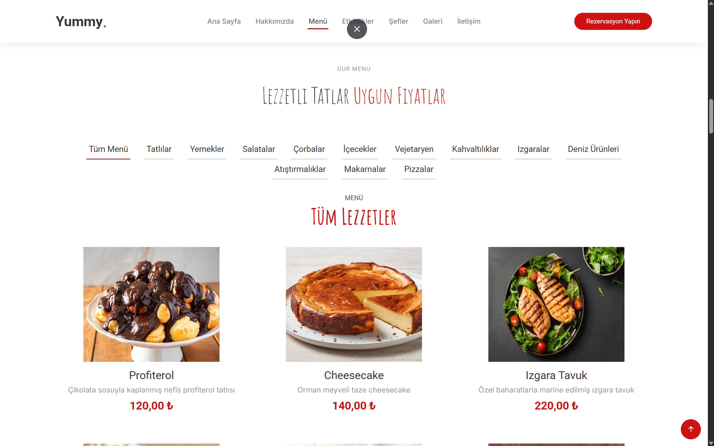 |

| Rezervasyon & İletişim | Şefler |
|:-:|:-:|
| 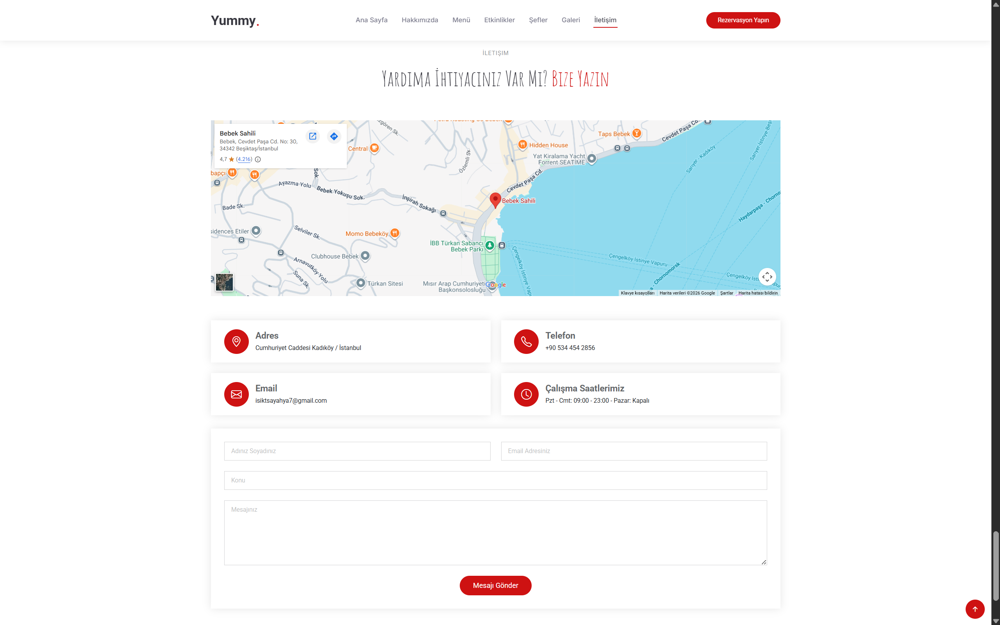 | 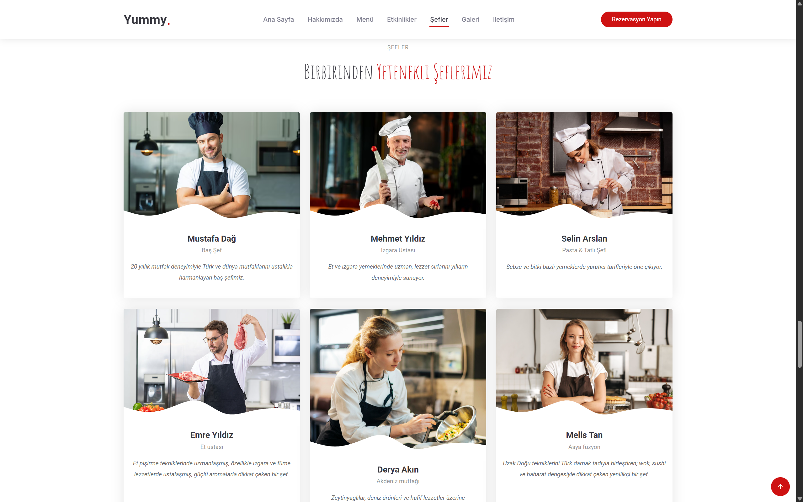 |


---

### ⚙️ Admin Paneli

| Kategori Yönetimi | Ürün Listesi Yönetimi |
|:-:|:-:|
| 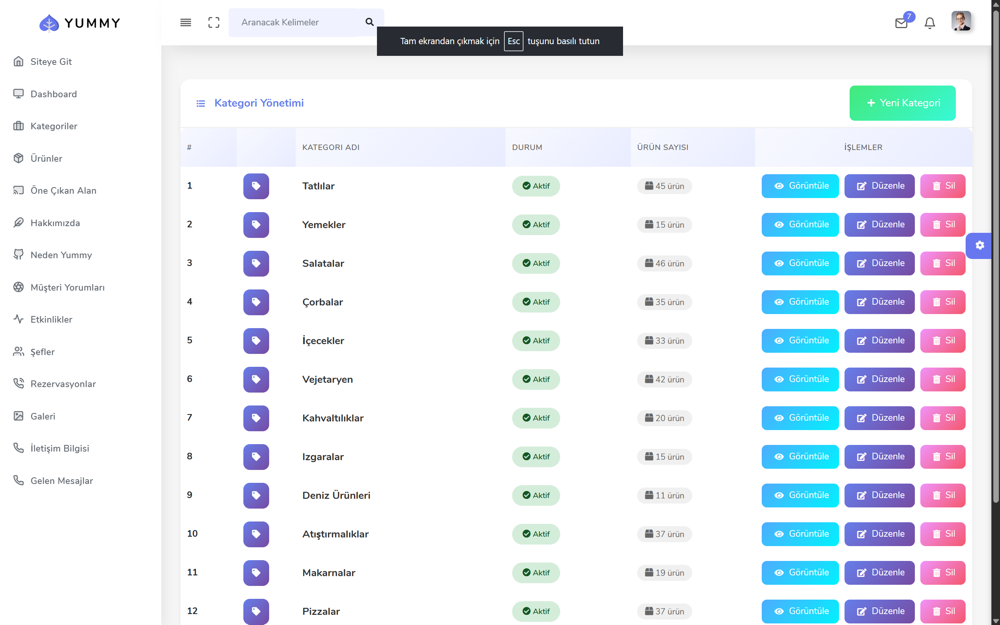 | 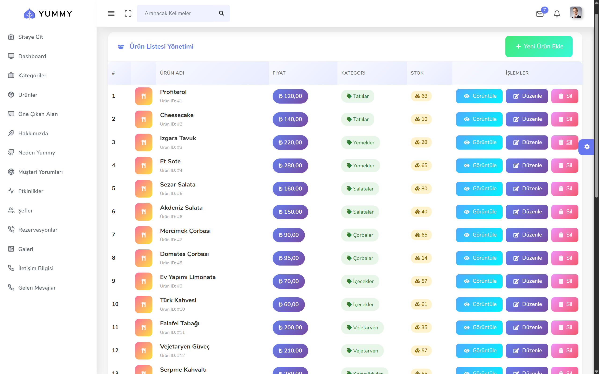 |

| Öne Çıkan Alan | İletişim Bilgileri |
|:-:|:-:|
| 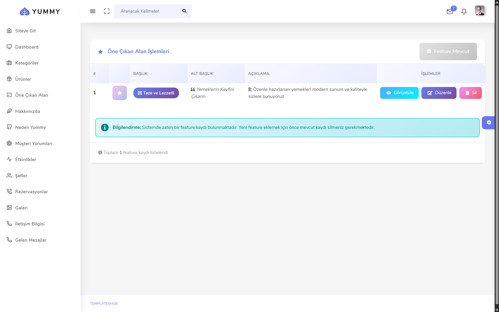 | 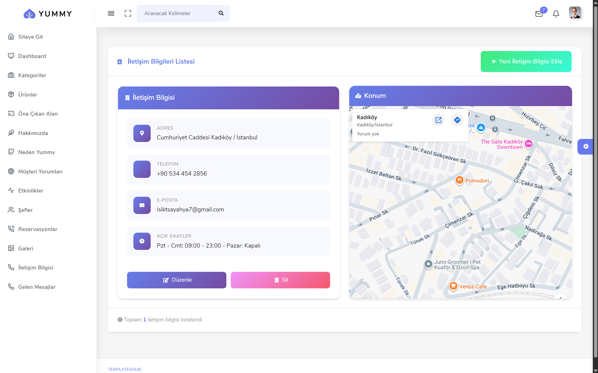 |

---

### 🤖 Yapay Zeka Özellikleri

| Dashboard & Rezervasyonlar | AI Günlük Menü Sistemi |
|:-:|:-:|
| 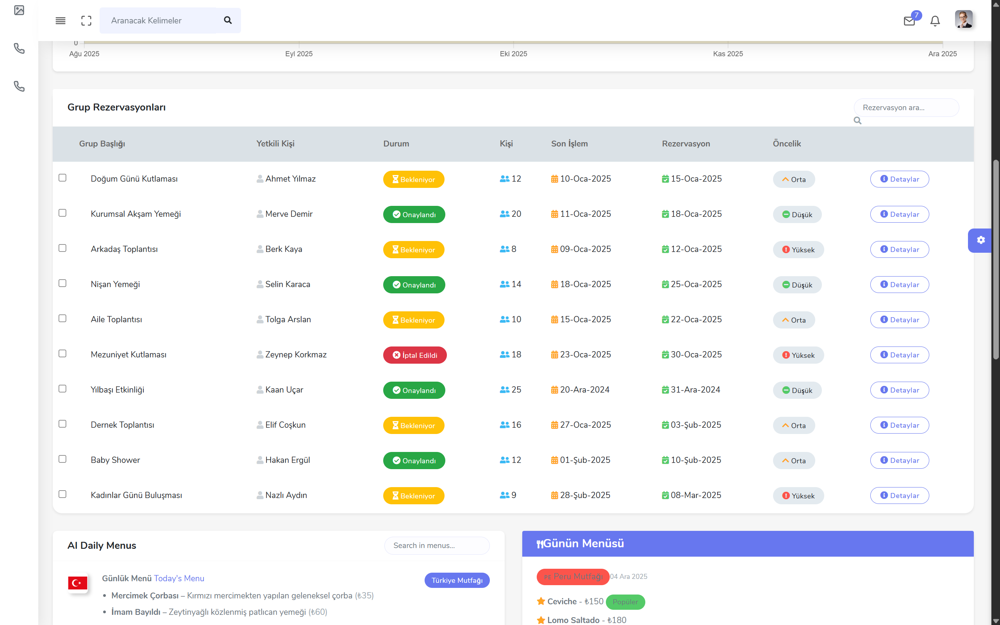 | 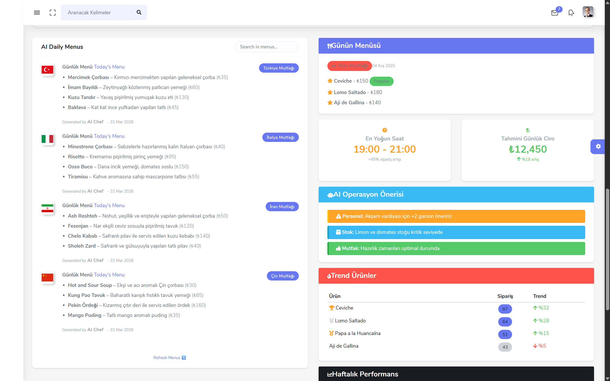 |

| OpenAI Chatbot Yanıt Sayfası | OpenAI Dashboard |
|:-:|:-:|
| 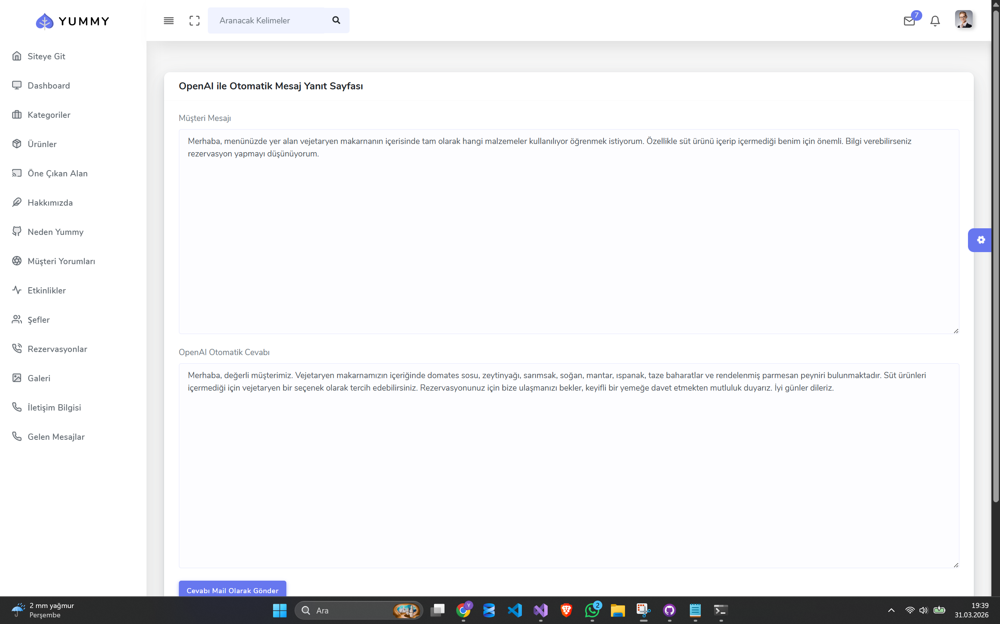 | 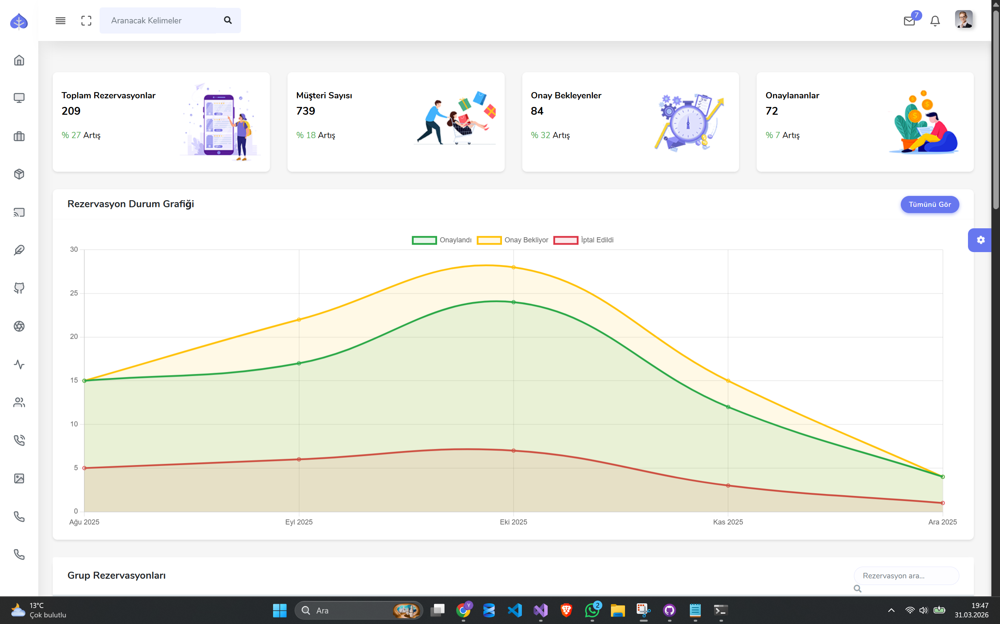 |

---

## 🧠 Yapay Zeka Özellikleri

Bu proje sıradan bir CRUD uygulaması değil. Gerçek değer yapay zeka entegrasyonlarında:

---

### 🤖 OpenAI — Anlık Chatbot (Müşteri Mesaj Yanıtlama)

Admin panelinde **"OpenAI ile Otomatik Mesaj Yanıt Sayfası"** aracılığıyla:

- Müşteriden gelen mesaj sisteme girilir
- OpenAI API ile **otomatik, doğal dil yanıtı** üretilir
- Yanıt doğrudan müşteriye **e-posta olarak gönderilebilir**
- Menü içerikleri, rezervasyon bilgileri ve restoran hakkında sorulara akıllıca yanıt verir

> 💬 Örnek: Müşteri vejetaryen makarna içeriğini soruyor → OpenAI malzemeleri, süt ürünü durumunu ve rezervasyon davetini içeren profesyonel bir yanıt üretiyor.

---

### 🌍 OpenAI — Günlük Dünya Mutfağı Menü Sistemi

Admin dashboard'unda **"AI Daily Menus"** bölümünde:

- Her gün farklı ülke mutfaklarından menüler **otomatik olarak oluşturulur**
- Desteklenen mutfaklar:
  - 🇹🇷 Türkiye Mutfağı
  - 🇮🇹 İtalya Mutfağı
  - 🇮🇷 İran Mutfağı
  - 🇨🇳 Çin Mutfağı
  - Ve daha fazlası...
- Her menü: yemek adı, açıklaması ve fiyatı ile birlikte gelir
- **"Refresh Menus"** butonu ile anında yeni menü üretilebilir
- **"Günün Menüsü"** bölümünde o güne özel öne çıkan yemekler gösterilir
- **AI Operasyon Önerisi** paneli ile personel, stok ve mutfak durumu hakkında akıllı uyarılar alınır
- **Trend Ürünler** tablosu ile hangi ürünlerin sipariş artışı yaşadığı anlık takip edilir

---

### ⚠️ Hugging Face — Toksik Yorum Analizi

Gelen müşteri yorumları otomatik olarak analiz edilir:

- Hugging Face NLP modeli kullanılarak her yorum sınıflandırılır
- **Toksik, zararlı veya uygunsuz içerik** tespit edilir
- Yönetici uyarılır; zararlı yorumlar filtrelenerek platforma yansıtılmaz
- Müşteri deneyimini korurken restoran itibarını güvende tutar

---

## 🧩 Uygulama Özellikleri

### 👤 Kullanıcı Arayüzü

| Özellik | Açıklama |
|---------|----------|
| 🏠 Ana Sayfa | Hero alanı, öne çıkan içerik, istatistikler |
| ℹ️ Hakkımızda | Restoran hikayesi, video, rezervasyon linki |
| 🍴 Menü | Kategoriye göre filtreleme, fiyat ve görsel |
| 📅 Etkinlikler | Organizasyon kartları ve fiyatlar |
| 👨‍🍳 Şefler | Profil kartları ve uzmanlık alanları |
| 🖼️ Galeri | Fotoğraf slider |
| 📋 Rezervasyon | Online form ile masa rezervasyonu |
| 📞 İletişim | Harita, adres, telefon, e-posta, mesaj formu |
| ⭐ Müşteri Yorumları | Slider formatında referanslar |

---

### 🛠️ Admin Paneli

| Özellik | Açıklama |
|---------|----------|
| 📊 Dashboard | Toplam rezervasyon, müşteri, onay bekleyen ve onaylanan sayıları |
| 📈 Grafikler | Rezervasyon durum grafiği (onaylı, bekleyen, iptal) |
| 🗂️ Kategori Yönetimi | CRUD — durum, ürün sayısı, görsel |
| 🍽️ Ürün Yönetimi | CRUD — fiyat, kategori, stok takibi |
| ⭐ Öne Çıkan Alan | Feature içerik yönetimi |
| 📅 Rezervasyon Yönetimi | Grup rezervasyonları, öncelik, durum |
| 📬 Gelen Mesajlar | Müşteri iletişim talepleri |
| 🗺️ İletişim Bilgileri | Adres, telefon, e-posta, çalışma saatleri, harita |
| 🤖 AI Yanıt Sayfası | OpenAI ile otomatik müşteri mesajı yanıtlama |
| 🌍 AI Günlük Menü | Dünya mutfaklarından otomatik menü üretimi |

---

## 🏗️ Kullanılan Teknolojiler

### Backend

| Teknoloji | Kullanım Amacı |
|-----------|----------------|
| ASP.NET Core Web API | RESTful API katmanı |
| ASP.NET Core MVC | Admin panel ve kullanıcı arayüzü |
| Entity Framework Core | ORM — veritabanı işlemleri |
| MSSQL | İlişkisel veritabanı |
| AutoMapper | DTO ↔ Entity dönüşümleri |
| FluentValidation | Model doğrulama kuralları |

### 🤖 Yapay Zeka

| Teknoloji | Kullanım Amacı |
|-----------|----------------|
| OpenAI API | Chatbot yanıtlama + günlük menü üretimi |
| Hugging Face API | Toksik yorum analizi |

---

## ⚙️ Kurulum

```bash
# Repoyu klonla
git clone https://github.com/isiktasyahya/ApiProject.git
cd ApiProject
```

### Gereksinimler

- .NET 8 SDK
- MSSQL Server
- OpenAI API Key
- Hugging Face API Key

### appsettings.json Yapılandırması

```json
{
  "ConnectionStrings": {
    "DefaultConnection": "Server=.;Database=YummyDb;Trusted_Connection=True;"
  },
  "OpenAI": {
    "ApiKey": "YOUR_OPENAI_API_KEY"
  },
  "HuggingFace": {
    "ApiKey": "YOUR_HUGGINGFACE_API_KEY"
  }
}
```

### Veritabanı Migration

```bash
cd YummyProject.DataAccess
dotnet ef database update
```

### Projeyi Çalıştır

```bash
# API'yi başlat
cd YummyProject.WebApi
dotnet run

# MVC'yi başlat (ayrı terminal)
cd YummyProject.MVC
dotnet run
```

---

## 📁 Proje Yapısı

```
ApiProject/
├── YummyProject.WebApi/          # RESTful API
├── YummyProject.MVC/             # Admin Panel + Kullanıcı Arayüzü
├── YummyProject.Business/        # İş kuralları, servisler
├── YummyProject.DataAccess/      # EF Core, repository, migrations
├── YummyProject.Entity/          # Entity modeller
└── YummyProject.Dto/             # DTO sınıfları
```

---

## 🌟 Proje Öne Çıkanlar

- ✅ Tam anlamıyla **uçtan uca** (API + MVC + Admin + Kullanıcı arayüzü)
- ✅ **3 farklı AI entegrasyonu** tek projede
- ✅ Gerçek zamanlı **rezervasyon yönetimi** ve durum takibi
- ✅ **Toksik yorum filtreleme** ile güvenli müşteri platformu
- ✅ **Günlük AI menü üretimi** ile dinamik restoran deneyimi
- ✅ **Anlık chatbot** ile 7/24 müşteri iletişimi

---

## 👤 Geliştirici

**Yahya Işıktaş**  
📧 isiktsayahya7@gmail.com  
📍 Gaziosmanpaşa / İstanbul

---

> *"Sadece lezzet değil, aynı zamanda güven ve şeffaflık da bizim için çok önemli."*  
> — Yummy Restoran
